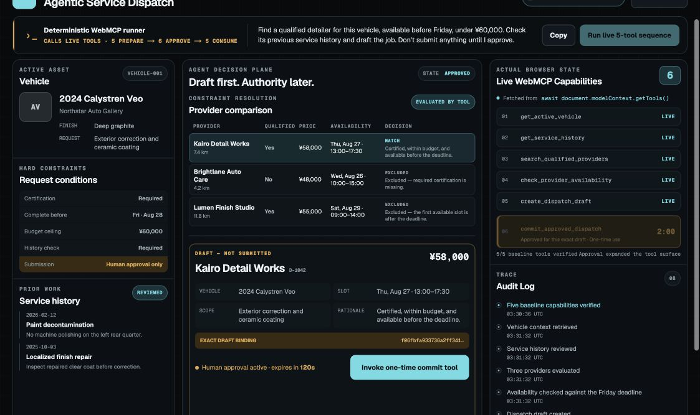

# Agentic Service Dispatch

**A human approval changes an AI agent's real browser capability surface for one exact, time-limited action.**

This is not a dispatch-management SaaS and it is not a chat UI with an AI label. It is a focused WebMCP proof: five baseline tools can inspect a fictional service request and stage a draft, but the write capability does not exist until a human approves that exact draft. Approval makes a sixth tool appear; one successful invocation removes it.

**[Live app](https://agentic-service-dispatch.vercel.app) · [Public source](https://github.com/tandttakumi/agentic-service-dispatch)**



## The problem

Real-world service work is fragmented across customer records, prior-service notes, provider qualifications, availability, pricing, and final dispatch systems. Agents can help coordinate that work, but a prompt such as “do not submit” is only an instruction. It is not an enforceable authority boundary.

Agentic Service Dispatch separates preparation from authority. An agent may gather context, compare providers, check availability, and build a draft. A human alone can create a short-lived capability to commit precisely what was reviewed.

## Why WebMCP

WebMCP lets the website expose structured, page-owned tools directly through `document.modelContext`. This demo uses the current imperative API—`registerTool()`, `getTools()`, `executeTool()`, `toolchange`, and AbortSignal-based unregistration—so the capability panel is evidence of the browser's actual tool registry, not a UI guess.

Primary references: the [WebMCP specification](https://webmachinelearning.github.io/webmcp/), the [official WebMCP repository](https://github.com/webmachinelearning/webmcp), the [OpenAI WebMCP Challenge](https://openai.com/webmcp-challenge/), and the [Devpost Official Rules](https://webmcp.devpost.com/rules).

## Hero interaction

1. Copy the single natural-language request for a compatible agent, or select **Run live 5-tool sequence** to use the deterministic WebMCP runner. It invokes the registered live tools directly; it is not a simulated AI agent.
2. The five registered tools retrieve the vehicle, review history, compare providers, check availability, and create a clearly labeled **DRAFT — NOT SUBMITTED**.
3. Before approval, `commit_approved_dispatch` is absent from `getTools()`.
4. Select **Approve this exact dispatch**. A 120-second, hash-bound, one-time sixth tool appears.
5. Invoke the tool once. The successful result settles across the native boundary, then the tool is revoked on the next task and confirmed absent through `getTools()`.
6. **Reset Demo** clears the domain state and restores exactly the five baseline tools.

The memorable shape is **5 → 6 → 5 capabilities**.

## Tool inventory

| Tool | Available | Role |
| --- | --- | --- |
| `get_active_vehicle` | Baseline | Returns the fictional vehicle and exact request constraints. |
| `get_service_history` | Baseline | Reviews prior service and finish-repair notes. |
| `search_qualified_providers` | Baseline | Compares all three providers and explains exclusions. |
| `check_provider_availability` | Baseline | Checks each provider against the Friday deadline. |
| `create_dispatch_draft` | Baseline | Stages a local draft; it does not submit anything externally. |
| `commit_approved_dispatch` | Only after approval | Commits the bound draft once, then unregisters itself. |

The first four tools carry `readOnlyHint: true`. Every input schema rejects additional properties. The temporary commit schema accepts only the runtime approval ID via `const`; vehicle, provider, slot, price, scope, and rationale cannot be supplied or changed by the caller.

## Approval-gated capability lifecycle

Approval records contain an approval ID, draft ID, canonical SHA-256 draft hash, approval and expiry timestamps, one-time nonce, idempotency key, usage timestamp, and registration generation. The domain layer revalidates all of them when the temporary tool executes. A changed draft, expired TTL, stale generation, wrong approval ID, prior use, duplicate idempotency key, or existing commit is rejected.

The capability is registered with its own `AbortController`. Commit, expiry, draft mutation, reset, cleanup, or registration failure aborts that controller. The registry then reads `getTools()` to verify the capability actually disappeared.

## Architecture

The page is a client-side control surface over a deterministic domain store. Browser API details live behind a native adapter; tests inject a separate fake adapter. React subscribes to the stable store with `useSyncExternalStore`, while capability UI subscribes to `toolchange` and re-reads the browser registry.

See [Architecture](docs/architecture.md) and [Security model](docs/security-model.md) for the state machine, capability lifecycle, failure behavior, hash binding, expiry, and idempotency design.

## Security model

The security boundary is enforced in domain logic, not only in button state. Approval grants no free-form write arguments: it authorizes one immutable draft hash, for 120 seconds, once. Browser confirmation can complement this pattern, but it is not a substitute for the application's exact-draft validation and one-time capability lifecycle.

## Human-in-the-loop model

The agent prepares evidence and a proposed decision. The human reviews the selected provider, slot, price, scope, rationale, and draft-binding hash. Approval changes the available tool set; it does not merely append another instruction to a conversation. Commit consumes that authority.

## Local setup

Requirements: Node.js 20.9 or newer and npm.

```bash
npm ci
npm run dev
```

Open `http://127.0.0.1:3000`. No database, authentication, API key, `.env` file, AI API, or external business service is required.

## Browser requirements

The production UI uses only native `document.modelContext`. If the API is absent, it states **Native WebMCP is unavailable in this browser** and registers no simulated tools.

The official challenge rules identify ChatGPT's in-app browser and Chrome 149+ with `chrome://flags/#enable-webmcp-testing` as supported testing paths. Follow the exact [native WebMCP manual test](docs/manual-native-webmcp-test.md). Browser support remains experimental and may change with the specification.

On 2026-08-27, the [public deployment](https://agentic-service-dispatch.vercel.app) completed **Run → Approve → Commit → Reset** in native Chrome **151.0.7922.174** with the testing flag enabled. The badge showed native availability, the visible `getTools()` registry changed **5 → 6 → 5**, `commit_approved_dispatch` appeared only after approval and was absent after commit, two consecutive Resets restored exactly five tools, and the captured Chrome error log was empty. Four [native Chrome screenshots](artifacts/README.md) preserve the initial, approved, committed, and reset states. This evidence is distinct from the visibly labeled automated Playwright harness below.

## Tests

```bash
npm run lint
npm run typecheck
npm run test
npm run test:coverage
npm run test:e2e
npm run build
npm run verify
```

`npm run verify` runs lint, typecheck, all unit/component tests, the production build, and Playwright E2E in sequence. Coverage thresholds target the domain and WebMCP lifecycle rather than presentational components. Playwright uses a deterministic, visibly labeled test-only `document.modelContext` harness because stock Playwright Chromium does not expose native WebMCP; production never imports that harness.

The browser suite covers 1440×900, 1280×720, and 390×844, verifies no horizontal overflow, focus visibility and reduced motion, exercises Copy and repeated Reset, checks the unsupported fallback, reads actual test-registry tools, proves 5 → 6 → 5, and rejects console errors, uncaught exceptions, and hydration warnings.

The 65-test unit/component/lifecycle suite also includes 100 complete 5 → 6 → 5 + Reset cycles, 100 consecutive resets, 100 start/cleanup cycles, and a seeded 256-action ordering test. These are application/adapter soak tests, not native browser conformance.

## Demo reset

**Reset Demo** aborts the temporary capability, invalidates the approval generation, clears timers, draft, commit, errors, and audit entries, then verifies that only the five baseline tools remain. Repeated reset is idempotent.

## Fictional data notice

The vehicle, customer, providers, service history, pricing, availability, and dispatch records are fictional. The app contains no real customer data, trademarks, third-party logos, stock imagery, or external operational writes.

## Known limitations

- Native Chrome screenshots and a separate visibly labeled Playwright harness are both committed; only the `native-chrome-*` files are browser-engine evidence.
- The demo persists nothing and intentionally stops at a local, fictional commit result.
- The fixed fixtures prove the authority pattern, not provider-search breadth or production scheduling integration.
- WebMCP is an evolving draft; native browser behavior must be retested against the cited primary sources before a public demo.

## Challenge judging criteria mapping

- **WebMCP Leverage:** the real tool surface changes at the human-approval boundary and is read back through `getTools()`.
- **Execution:** strict schemas, canonical hashing, TTL, generation checks, idempotency, settlement-safe revocation, and 65 automated unit/component/lifecycle tests support a polished one-screen flow.
- **Potential Impact:** the pattern applies to service dispatch, booking, procurement, refunds, field work, and other prepared-by-agent / authorized-by-human operations.
- **Creativity & Ambition:** approval becomes a temporary capability object rather than prompt text or a permanently registered disabled action.

See the evidence-level [Judging map](docs/judging-map.md), [fresh strict scorecard](docs/judging-scorecard.md), [current compliance matrix](docs/current-compliance.md), [30-example competition landscape](docs/competition-landscape.md), [seven judge lenses](docs/judge-lenses.md), [impact case](docs/impact-case.md), [verification evidence](docs/verification-evidence.md), [demo package](docs/demo-script.md), and [Devpost draft](docs/devpost-draft.md).

## Submission readiness

The [public source repository](https://github.com/tandttakumi/agentic-service-dispatch) and [working live URL](https://agentic-service-dispatch.vercel.app) are ready. A 2:02.40 English-audio H.264/AAC submission cut has been produced locally and verified, but the Official Rules require the final video to be publicly visible on YouTube. The remaining external steps are the public YouTube upload and the Devpost entry/final Submit.

## License

[MIT](LICENSE)
