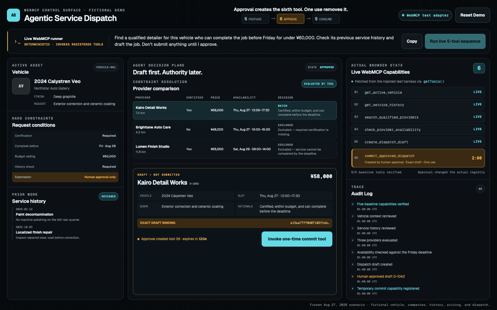

# Agentic Service Dispatch

**Five page-owned WebMCP tools prepare a fictional dispatch. Human approval creates one exact commit tool; one use removes it.**

The live registry changes **5 PREPARE → 6 APPROVE → 5 CONSUME**. Baseline tools may inspect and draft, but `commit_approved_dispatch` does not exist until a human approves the reviewed draft.

Approval changes capability—not prompt text.

**[Live app](https://agentic-service-dispatch.vercel.app) · [Source repository](https://github.com/tandttakumi/agentic-service-dispatch)**

Final candidate source `ef35cfc` passed the human-operated native Chrome release gate on 2026-08-30. Public-v1 evidence remains separately preserved and labeled.



*FINAL CANDIDATE · TEST ADAPTER · APPLICATION EVIDENCE · NOT NATIVE.*

Separate engine evidence remains preserved as the [public-v1 native Chrome approved frame](artifacts/native-chrome-approved.png) and its [four-state evidence index](artifacts/README.md); it is not relabeled as final-candidate proof. The final candidate's distinct human-operated native result is recorded in the [2026-08-30 release-gate evidence](docs/final-candidate-native-evidence.md).

## The problem

Real-world service work is fragmented across customer records, prior-service notes, provider qualifications, availability, pricing, and final dispatch systems. Agents can help coordinate that work, but a prompt such as “do not submit” is only an instruction. It is not an enforceable authority boundary.

The entrant is a founder/operator of an automotive and service business. The workflow was abstracted from firsthand work crossing vehicle context, prior service history, provider qualifications, price, availability, constraints, selection, and final request authority. Every company, vehicle, provider, record, price, and outcome in the demo is fictional.

Agentic Service Dispatch separates preparation from authority. An agent may gather context, compare providers, check availability, and build a draft. The visible approval control—not another WebMCP tool—creates a short-lived capability to commit precisely what was reviewed.

## Why WebMCP

WebMCP lets the website expose structured, page-owned tools directly through `document.modelContext`. This demo uses the current imperative API—`registerTool()`, `getTools()`, `executeTool()`, `toolchange`, and AbortSignal-based unregistration—so the capability panel is evidence of the browser's actual tool registry, not a UI guess.

Primary references: the [WebMCP specification](https://webmachinelearning.github.io/webmcp/), the [official WebMCP repository](https://github.com/webmachinelearning/webmcp), the [OpenAI WebMCP Challenge](https://openai.com/webmcp-challenge/), and the [Devpost Official Rules](https://webmcp.devpost.com/rules).

## Hero interaction

1. Copy the single natural-language request for a compatible agent, or select **Run live 5-tool sequence** to use the deterministic WebMCP runner. It invokes the registered live tools directly; it is not a simulated AI agent.
2. The five registered tools retrieve the vehicle, review history, compare providers, check availability, and create a clearly labeled **DRAFT — NOT SUBMITTED**.
3. Before approval, `commit_approved_dispatch` is absent from `getTools()`.
4. Select **Approve this exact dispatch**. A 120-second, hash-bound, one-time sixth tool appears.
5. Invoke the tool once. The successful result settles across the caller boundary, then the tool is revoked on the next task and confirmed absent through `getTools()`. This timing was verified in native Chrome for both public v1 and final candidate source `ef35cfc`.
6. **Reset Demo** clears the domain state and restores exactly the five baseline tools.

The memorable shape is **5 → 6 → 5 capabilities**.

## Real-agent verification

On **2026-08-31 (JST)**, **Codex + official Chrome DevTools for agents** selected and executed the public page's registered WebMCP tools from a natural-language business request, without page-tool names or an execution order in the prompt.

Actual order: `get_active_vehicle` → `get_service_history` → `search_qualified_providers` → `check_provider_availability` → `create_dispatch_draft` → **human approval of the exact draft** → `commit_approved_dispatch`.

The five preparation tools produced **DRAFT — NOT SUBMITTED**. After human approval, the only added tool was `commit_approved_dispatch`. Codex rediscovered it with `list_webmcp_tools`, executed it once through `execute_webmcp_tool`, and verified revocation: **5 → 6 → 5**. All six page-tool executions completed.

This is separate evidence from the on-page deterministic runner and the Playwright test adapter; neither was used in this real-agent run. It is **not ChatGPT Site tools**. **Reset Demo was not verified through this agent route**; the separate human-operated native Chrome Reset check remains labeled as such. The fixed, fictional scenario demonstrates model-selected tool execution, not unrestricted planning or a real commercial booking.

Environment: Chrome **151.0.7922.174**, official Chrome DevTools MCP **1.8.0**, Codex **0.151.0-alpha.7.2**, using an isolated Chrome profile. [Recorded tool arguments, registry observations, and page screenshots](docs/real-agent-verification.md).

## Tool inventory

| Tool | Available | Role |
| --- | --- | --- |
| `get_active_vehicle` | Baseline | Returns the fictional vehicle and exact request constraints. |
| `get_service_history` | Baseline | Reviews prior service and finish-repair notes. |
| `search_qualified_providers` | Baseline | Compares all three providers and explains exclusions. |
| `check_provider_availability` | Baseline | Checks each provider against the Friday deadline. |
| `create_dispatch_draft` | Baseline | Stages a local draft; it does not submit anything externally. |
| `commit_approved_dispatch` | Only after approval | Commits the bound draft once, then unregisters itself. |

The first four tools carry `readOnlyHint: true`. Every input schema rejects additional properties, and callbacks independently require non-coercing plain JSON values. The temporary commit schema accepts only the runtime approval ID via `const`; vehicle, provider, slot, price, scope, and rationale cannot be supplied or changed by the caller.

## Approval-gated capability lifecycle

Approval records contain an approval ID, draft ID, canonical SHA-256 draft hash, approval and expiry timestamps, one-time nonce, nonce-bound idempotency key, usage timestamp, and registration generation. The domain layer revalidates them and the original qualified draft when the temporary tool executes. A changed draft, expired TTL, stale generation, wrong approval ID, altered approval record, prior use, duplicate idempotency key, or existing commit is rejected. Tool results are detached from fixed fixture state before crossing the caller boundary.

The capability is registered with its own `AbortController`. Commit, expiry, draft mutation, Reset, cleanup, or registration failure aborts that controller. The callback combines that page-owned registration signal with the invocation signal through exact-surface verification and the post-digest domain cancellation check, so cleanup during validation preserves an unused approval even if the host does not abort the invocation separately. Once the temporary tool is established, commit-, expiry-, mutation-, and Reset-driven cleanup reads `getTools()` back to verify the expected surface. A canceled or failed pending registration remains fail-closed but makes no standalone physical-removal claim; UI or a later lifecycle proof must observe the registry. Unmount cleanup likewise aborts the current registration controller without claiming physical removal or a post-stop read-back; a later full remount re-verifies the surface and may reconcile an otherwise valid unconsumed approval.

## Architecture

The page is a client-side control surface over a deterministic domain store. Browser API details live behind a native adapter; tests inject a separate fake adapter. React subscribes to the stable store with `useSyncExternalStore`, while capability UI subscribes to `toolchange` and re-reads the browser registry.

See [Architecture](docs/architecture.md) and [Security model](docs/security-model.md) for the state machine, capability lifecycle, failure behavior, hash binding, expiry, and idempotency design.

## Security model

The security boundary is enforced in domain logic, not only in button state. Approval grants no free-form write arguments: it authorizes one exact draft hash, for 120 seconds, once. Changing that draft invalidates the approval. Browser confirmation can complement this pattern, but it is not a substitute for the application's exact-draft validation and one-time capability lifecycle.

## Human-in-the-loop model

The agent prepares evidence and a proposed decision. The human reviews the selected provider, slot, price, scope, rationale, and draft-binding hash. Approval changes the available tool set; it does not merely append another instruction to a conversation. Commit consumes that authority.

## Potential impact

**Customer.** Service coordinators in automotive, field service, maintenance, repair, inspection, installation, and similar operational businesses.

**Pain.** One coordinator may have to cross asset or vehicle context, previous service history, provider qualification, pricing, availability, multiple constraints, exclusion reasons, repeated data entry, and final submission authority before one consequential request can be released.

**Value.** The agent prepares one structured decision through page-owned WebMCP tools. The human reviews one exact draft. Approval creates one exact, temporary write capability; one approved action consumes it; the capability then disappears. The page keeps the reviewed object, capability lifecycle, and audit trace visible to both the human and the agent.

**Practical impact to validate.** This design targets fewer dropped operational constraints, visible reasons for excluding unsuitable providers, less fragmented coordination and re-entry, no permanently exposed broad commit capability, exact-object human approval, and inspectable authority. These are concrete pilot hypotheses, not measured outcomes.

Built from firsthand experience coordinating real automotive and service operations, Agentic Service Dispatch turns one concrete vehicle-service workflow into a reusable authority pattern: the agent prepares the operational decision, but consequential authority exists only for the exact action a human reviewed and approved.

The same prepare/review/authorize/revoke pattern can be tested in field service, maintenance, repair, inspection, installation, procurement, and similar workflows. Those are transfer paths for future pilots, not claims of existing adoption. No production-user, time-saving, financial-impact, or market-size result is claimed.

## Local setup

Requirements: Node.js 24.15 or newer within the Node 24 line, plus npm. The checked-in `.nvmrc` pins the locally verified 24.18.0 release; `package.json#engines` plus the project `.npmrc` reject runtimes outside that lockfile-compatible range.

```bash
npm ci
WEBMCP_DEV_PORT=3100
npm run dev -- --hostname 127.0.0.1 --port "$WEBMCP_DEV_PORT"
```

Open the local URL printed by the command. The variable is only a local run choice; the application does not fix a production port. No database, authentication, API key, `.env` file, AI API, or external business service is required.

## Browser requirements

The production UI uses only native `document.modelContext`. If the API is absent, malformed, throwing, or missing a required method/event surface, it fails closed and registers no simulated tools. Native `getTools()` reads have a one-second application bound; non-settling registration or outer invocation remains an explicit engine-gate failure rather than being converted into simulated success.

The official challenge rules identify ChatGPT's in-app browser and Chrome 149+ with `chrome://flags/#enable-webmcp-testing` as supported testing paths. Follow the exact [native WebMCP manual test](docs/manual-native-webmcp-test.md). Browser support remains experimental and may change with the specification.

On 2026-08-27, public v1 (public commit `028bba44`) completed **Run → Approve → Commit → Reset** in native Chrome **151.0.7922.174** with the testing flag enabled. The badge showed native availability, the visible `getTools()` registry changed **5 → 6 → 5**, `commit_approved_dispatch` appeared only after approval and was absent after commit, two consecutive Resets restored exactly five tools, and the captured Chrome error log was empty. Four [native Chrome screenshots](artifacts/README.md) preserve the initial, approved, committed, and reset states. The [historical verification record](docs/verification-evidence.md) identifies the tested runtime source and later publication-only changes.

On 2026-08-30, the exact final candidate source `ef35cfc` and runtime/toolchain digest `abfc8f4…a4f7` completed a separate uninterrupted human-operated native Chrome **5 → 5 → 6 → 5 → Reset → 5** gate in the same Chrome version. Tool 06 was only `commit_approved_dispatch`; the operator observed no error, duplicate, stuck state, or stopped transition. The [final-candidate native evidence](docs/final-candidate-native-evidence.md) records the identity and evidence boundary without relabeling Playwright artifacts.

## Tests

```bash
npm run lint
npm run typecheck
npm run test
npm run test:coverage
npm run test:e2e
npm run test:e2e:evidence # explicit screenshot refresh only
npm run build
npm run verify
```

`npm run verify` runs lint, typecheck, the coverage-gated unit/component suite, the production build, and Playwright E2E against that built application in sequence. Coverage measures executable `src` files, including the native and test adapters, while excluding framework entry files and type-only declarations; enforced statement/branch/function/line floors are 94/90/97/95%. Playwright uses a deterministic, visibly labeled test-only `document.modelContext` harness because stock Playwright Chromium does not expose native WebMCP; production never imports that harness.

The tracked GitHub Actions workflow requests only `contents: read`, uses the same `.nvmrc`, installs the locked npm dependencies and Playwright's Chromium runtime, and runs `npm run verify` serially. No remote run was used as pre-publication evidence; inspect the Actions result for the published commit separately.

The ten-flow browser suite covers 320, 360, 390, 768, 1024, 1280, 1440, and 1920px widths; verifies long-text wrapping, no horizontal overflow, ≥44px controls, focus visibility, reduced motion, forced-colors operation, a 200% page-scale check, screen-reader lifecycle status, and a keyboard-only lifecycle; exercises Copy and Reset across multiple flows; checks state-specific post-commit failure guidance and the unsupported fallback; reads actual test-registry tools; proves 5 → 6 → 5; and rejects console errors, uncaught exceptions, and hydration warnings.

The 290-test unit/component/lifecycle suite includes 74 explicit agent-input scenarios plus one matrix-count guard, 48 race-laboratory cases, exact native-schema/deterministic-runner input alignment, mounted countdown-driven TTL expiry and revoke, the complete 6×6 phase-transition matrix and all-phase Reset postconditions, independent nonce, rollback-idempotency, and duplicate-draft retry regressions, hostile canonical-data and unavailable-crypto checks, approval-time and commit-time draft/approval mutation checks across asynchronous hashing, clock-rollback invalidation before and during commit validation, registration-signal cancellation during an in-flight commit digest and a delayed post-stop callback, a complete simulated Chrome string-schema/input bridge lifecycle, execution-time exact-registry checks, abort-aware exact-surface read and retry-delay cancellation, UI convergence across expected-surface changes, exhausted-read Reset recovery, delayed-startup recovery without `toolchange`, and `toolchange` storm coalescing, synchronous Reset authority invalidation, stale pre-Reset task rejection, registry-owner-bound lifecycle-error recovery, state-specific pre/post-commit failure presentation, 100 complete 5 → 6 → 5 + Reset cycles, 100 consecutive resets, 100 start/cleanup cycles, 40 fixed-seed normal/adversarial state-machine sweeps, and ten registered-tool order violations. Current coverage across executable `src` files is 96.02% statements, 93.67% branches, 98.64% functions, and 96.82% lines; it includes both native and test adapters and excludes framework entry files and type-only declarations. These are application/adapter tests, not native browser conformance.

## Demo reset

**Reset Demo** synchronously invalidates approval generation and clears the local domain state. Serialized browser cleanup then aborts the temporary registration and verifies that only the five baseline tools remain; older lifecycle completions cannot write into the new idle state. Repeated reset is idempotent.

## Fictional data notice

The demo is a frozen Aug 27, 2026 scenario. Its vehicle, customer, providers, service history, pricing, availability, and dispatch records are fictional. The app contains no real customer data or service-company branding, third-party logos, stock imagery, or external operational writes.

## AI-use disclosure

The current public-v2 [2:12 demo video](https://youtu.be/N8LuuoV7zKI) uses AI-generated narration, and that use is disclosed on YouTube. No AI-generated images were used. The video shows final-candidate native Chrome footage with a clearly labeled deterministic runner; it is not the separate Codex real-agent run documented above. Historical test-adapter images remain explicitly labeled as application evidence, not native or real-agent evidence. Codex assisted with implementation review, adversarial tests, copy, documentation, and demo-production support; the entrant directed the product and evidence boundaries.

## Known limitations

- Historical native Chrome screenshots, the separately recorded Codex real-agent run, and a visibly labeled Playwright harness are preserved with distinct source labels. The harness is application evidence, not native or real-agent evidence.
- The demo persists nothing and intentionally stops at a local, fictional commit result.
- The fixed fixtures prove the authority pattern, not provider-search breadth or production scheduling integration.
- The callback verifies the last observed native registry surface before domain validation; WebMCP does not provide an atomic registry-snapshot-and-consume operation across the later asynchronous digest.
- Candidate-native callback reads, successful-result settlement, and post-commit physical removal completed the 2026-08-30 primary release gate. Stop/unmount stress remains a separate manual engine check; automated adapters are not engine evidence.
- A native `registerTool()` or outer `executeTool()` Promise that never settles can leave the mounted UI pending. The app does not impose a timeout that could misreport or retry a commit whose callback may already have run; a stuck call fails the native release gate.
- WebMCP is an evolving draft; native browser behavior must be retested against the cited primary sources before a public demo.

## Challenge judging criteria mapping

- **WebMCP Leverage:** the real tool surface changes at the human-approval boundary and is read back through `getTools()`.
- **Execution:** strict schemas and callbacks, ambiguity-rejecting canonical hashing, exact approval-window and nonce binding, idempotency, settlement-safe revocation, and 290 automated unit/component/lifecycle tests support a polished one-screen flow.
- **Potential Impact:** an operator-derived coordination problem is expressed as a reusable prepare/review/authorize/revoke pattern for automotive and adjacent service operations, with practical benefits framed as testable pilot hypotheses rather than measured outcomes.
- **Creativity & Ambition:** approval becomes a temporary capability object rather than prompt text or a permanently registered disabled action.

See [Architecture](docs/architecture.md), [Security model](docs/security-model.md), the [final impact narrative](docs/FINAL_IMPACT_NARRATIVE.md), [native manual test](docs/manual-native-webmcp-test.md), [final-candidate native evidence](docs/final-candidate-native-evidence.md), [public-v1 verification evidence](docs/verification-evidence.md), [final video EDL](docs/FINAL_VIDEO_EDL.md), and [Devpost submission copy](submission/devpost-v3-final.md).

## Submission readiness

The official public endpoints are the [source repository](https://github.com/tandttakumi/agentic-service-dispatch) and [live app](https://agentic-service-dispatch.vercel.app). Public `main` publishes the byte-identical final-candidate runtime from source `ef35cfc`; [GitHub Actions](https://github.com/tandttakumi/agentic-service-dispatch/actions) independently reruns the tracked release gate for each published commit. The verified public-v2 [2:12 YouTube demo](https://youtu.be/N8LuuoV7zKI) records one final-candidate native WebMCP session in Chrome 151 and keeps the deterministic runner, AI narration, fictional data, and native evidence source-labeled. Final-candidate native gate evidence is also recorded in [the release-gate record](docs/final-candidate-native-evidence.md).

## License

[MIT](LICENSE)
