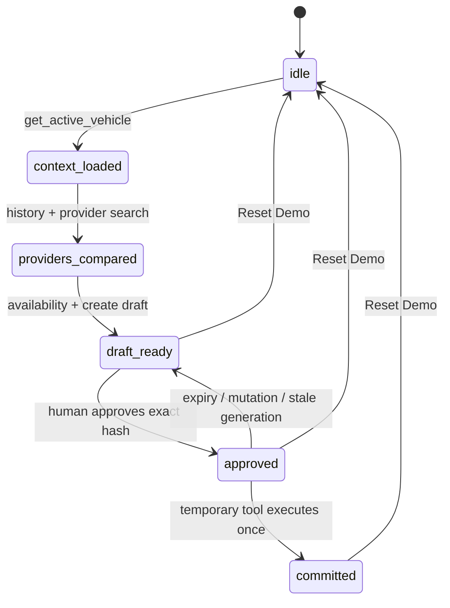

# Architecture

## Scope and source of truth

Agentic Service Dispatch is a browser-local proof of an approval-gated operational capability. It uses no server, database, model API, authentication, or external business API. Vehicle/request/provider data form a frozen Aug 27, 2026 fictional scenario; only the separate 120-second approval lifetime uses the current browser clock. The implementation follows the 26 August 2026 [WebMCP Draft Community Group Report](https://webmachinelearning.github.io/webmcp/) and the [official repository](https://github.com/webmachinelearning/webmcp): the imperative API is `document.modelContext`, registration accepts an AbortSignal, discovery uses `getTools()`, invocation uses `executeTool()`, and registry changes emit `toolchange`.

The implementation is checked against current primary sources. If `document.modelContext` is absent, throws during inspection, or lacks any required method/event surface, the production adapter returns `null` and the UI reports that native WebMCP is unavailable. A native `getTools()` read has a one-second fail-closed bound; rejection enters the existing bounded UI/registry retry paths instead of retaining stale evidence forever.

## Domain state machine



`DispatchStore` owns every transition and invariant. Components request actions and render snapshots; they do not decide whether a commit is valid. The store is stable across renders and exposed through `useSyncExternalStore`, preventing tool callbacks from capturing stale React state.

## WebMCP adapter boundary

`native-adapter.ts` is the only production wrapper around the experimental browser types. It delegates registration, discovery, execution, and `toolchange` subscription to `document.modelContext`. Chrome's current testing implementation has returned registered schemas as strings and accepted a DOMString execution input, so the adapter serializes arguments only when the returned schema is a string. The standards path remains object input and both branches are covered by regression tests.

`fake-adapter.ts` is imported only by unit and component tests. Playwright injects an independent deterministic context before page code executes and labels the page **WebMCP test adapter**.

Unsupported production browsers never fall back to the fake adapter.

## Tool registration

`ToolRegistry.start()` serializes lifecycle operations and registers the five baseline definitions with independently owned AbortControllers. It reads back `getTools()` and rejects missing or unexpected tools. If startup fails after subscription, it removes every listener and aborts every controller acquired so far. Cleanup aborts the controllers, including synchronously aborting a pending baseline registration before queued stop work can run. The wait is also resolved from that signal, so cleanup does not depend on an experimental adapter's registration promise settling after abort. Every awaited startup boundary checks the current desired lifecycle state before registering another tool or publishing an audit effect. Repeated or Strict Mode start/stop/start sequences are covered by tests and reject duplicate tool surfaces.

A lifecycle verification failure retains its historical audit entry and active error. The registry that recorded it hands off that failure's token only after its completed stop routine has aborted every registration it owns; the handoff alone does not claim physical removal. A later full start captures only that handed-off token, reconciles the approval-dependent surface, then performs a fresh exact-five or exact-six read-back. It clears the error only if the registry is still started, the expected approval generation is unchanged, and the same token is still active. A newer domain/registry failure, an interrupted proof, or an unrelated registry start cannot erase the error. A Strict Mode stop/start that cancels cleanup does not count as a fresh proof and does not clear it.

Soak coverage repeats 100 complete 5 → 6 → 5 + Reset lifecycles, 100 consecutive resets, 100 start/cleanup cycles, and a seeded 256-action ordering. These tests validate application and adapter invariants; they do not claim browser-engine conformance.

All schemas use `additionalProperties: false`. Fixed demo values use `const`, and callback validation independently requires plain JSON data properties: no coercion, accessors, symbols, hidden keys, sparse arrays, or custom prototypes. Domain logic repeats business constraints after that boundary. Tool descriptions state the required call order, and ten actual registered-tool order violations prove that failure does not change phase, revision, audit, or the five-tool registry.

## Dynamic capability lifecycle

```mermaid
sequenceDiagram
  participant A as Agent / demo executor
  participant W as WebMCP registry
  participant D as Domain store
  participant H as Human
  participant U as Capability UI

  A->>W: execute five baseline tools
  W->>D: build DRAFT — NOT SUBMITTED
  W-->>U: getTools() = 5
  H->>D: Approve this exact dispatch
  D->>D: canonicalize + SHA-256 + TTL + nonce
  D-->>W: register commit tool with AbortSignal
  W-->>U: toolchange; getTools() = 6
  A->>W: execute commit(approval_id)
  W->>W: getTools() = exact 6 before domain validation
  W->>D: revalidate approval and commit once
  D-->>W: consume approval and return success
  W-->>A: settle successful executeTool() result
  W->>W: next task: abort temporary controller
  W-->>U: toolchange; getTools() = 5
```

A store subscription asks the registry to reconcile after approval, expiry, mutation, commit, or reset. Reconciliation is queued, so a double click or overlapping event cannot interleave register and revoke operations. Reset is intentionally split: it synchronously increments a lifecycle epoch and clears domain authority, then serializes physical registration cleanup and exact-five read-back. A task, timer, verification completion, or error captured before that epoch change cannot append audit/error state to the reset snapshot. Reset also aborts an active old-epoch revocation read-back so it cannot start its 25/50ms retries or hold the queue; the one engine-owned `getTools()` Promise already issued may still settle and is ignored, while Reset's own exact-five read becomes the current proof. The controller for an in-flight tool-06 registration is tracked before its promise settles, allowing Reset, expiry, mutation, or unmount to abort it without waiting behind that same queue. Cleanup cancellation does not invalidate an otherwise valid approval, so a remount can reconcile it again. Tool 06's callback combines the page-owned registration signal with the host invocation signal, waits at a registration verification gate until `getTools()` proves the exact five baseline names plus `commit_approved_dispatch`, repeats the exact-six read immediately before entering domain validation, and keeps the combined signal through the asynchronous digest's post-await cancellation check. Thus stop/unmount during validation preserves an unused approval even if the host does not separately abort its invocation signal. A caller that discovers the tool in the registration/read-back interval cannot enter the domain; an invocation whose pre-domain read observes a foreign tool cannot commit. Registry verification tolerates one short rejected or stale visibility read, but keeps authority gated and requires the exact expected name set within a bounded 25/50ms retry window. Cancellation releases the page-side wait and prevents any follow-up retry or delay from starting. WebMCP cannot cancel a `getTools()` Promise already owned by the engine, so the currently issued host read may still settle after cleanup; its result is ignored and it cannot fan out into later reads. The deterministic runner resolves each named tool from the current registry with the same bounded window; permanent absence still rejects. A persistent registration/read-back failure invalidates the approval and rejects any waiting invocation; an execution-time mismatch preserves the approval for safe retry after the surface is corrected; revocation is recorded only after the exact five-name baseline is read back. Revocation audit deduplication uses a monotonic generation high-water mark, so its retained state remains constant-size across long sessions. The API does not make registry read and domain consumption atomic, so the guarantee is limited to the last exact-six read before domain validation.

Successful commit revocation is deliberately scheduled for the next task. Public-v1 native Chrome testing found that aborting the registration signal before the successful callback result crossed the browser boundary could turn a valid commit into an `UnknownError`. Domain authority is consumed synchronously; only physical unregistration waits one task, after which `getTools()` must show the exact five-tool baseline. Expiry or mutation of an established temporary tool and Reset abort without that success-settlement delay and perform exact-five verification. A canceled or failed pending registration aborts its controller and remains fail-closed, but makes no independent physical-removal claim until UI or a later lifecycle proof reads the registry. Generic cleanup/unmount likewise aborts owned controllers without claiming a post-stop physical-removal proof. The final candidate preserves this timing and passed its separate native lifecycle check on 2026-08-30.

## UI synchronization

The capability panel never synthesizes or renders a tool from the dispatch phase. `useCapabilities()` subscribes to `toolchange`, calls the adapter's `getTools()`, and renders only an actual snapshot matching the expected lifecycle surface: exact six while a live approval exists, exact five otherwise. A successful but one-generation-old snapshot clears proof and receives bounded 25/50ms follow-up reads even if no second event arrives. Successful registry startup and successful Reset also advance a UI-only refresh generation, so the panel performs a fresh adapter read even if the host omits a final `toolchange`; neither success state supplies or infers the displayed tools. A stale sixth tool while the domain is idle is rejected rather than displayed as approval proof. Within that UI hook, discovery reads are single-flight for its adapter; a burst of `toolchange` events coalesces into at most one pending trailing refresh instead of amplifying unresolved UI reads. Registry verification remains a separate safety path. A monotonic refresh generation prevents an older asynchronous read or retry timer from overwriting a newer tool surface. Cleanup removes the listener, clears retry state, and drops that trailing refresh. A persistent mismatch, read failure, or foreign/missing tool clears stale evidence and disables consequential actions rather than presenting assumed success.

The audit log is driven by actual store updates with an injected clock. No server/client fixed-time text is rendered, avoiding hydration mismatches. The approval countdown is client-only and its interval is cleaned up on phase change or unmount. A synchronous action lock also closes the interval before React can paint a disabled Run, Approve, Commit, or Reset control.

## Exact-draft hash binding

The approved object includes vehicle, provider, slot, price, scope, and rationale. `canonical-json.ts` recursively sorts object keys, rejects unsupported or ambiguous JSON containers, accessors, hidden/symbol properties, sparse arrays, cycles, and non-finite values, and produces stable UTF-8 bytes. SHA-256 binds the approval to the full canonical draft. Approval and commit compare against the original qualified draft and recompute the current hash. Commit captures canonical bytes before and after the asynchronous digest, rejecting and invalidating mutation before, during, or after hashing. It validates this canonical approval binding before caller-facing approval fields, so altered internal metadata cannot leave a usable temporary tool behind.

## Expiry, one-time use, and idempotency

Approval expires 120 seconds after hash binding completes. The store uses an injectable clock for deterministic boundary tests. Commit requires the current approval ID, approved status, unused record, live TTL, matching draft hash, uncommitted dispatch, nonce-bound unused idempotency key, and current registration generation. The final lifetime check and `committed_at` use the same clock reading. A native execution AbortSignal is checked before validation and after the asynchronous hash boundary; cancellation leaves the approval approved and unused. A valid commit marks the key used and approval consumed before returning the fictional result.

The one-time nonce is generated with `crypto.randomUUID()` and is part of the approval record; it is never accepted from a tool caller. The idempotency key prevents replay even if invocation races are attempted.

## Reset

Reset synchronously increments the approval generation and registry lifecycle epoch, clears in-flight approval state and used keys, and returns the domain snapshot to `idle`. Temporary registration-controller abort and exact-five registry read-back then finish in the serialized queue; only that read-back proves physical removal. Work that began in an older epoch cannot write a stale revoke audit or lifecycle error into the new idle snapshot. Reset is safe to invoke repeatedly.

## Failure handling

Domain failures use explicit codes such as `APPROVAL_NOT_FOUND`, `APPROVAL_EXPIRED`, `APPROVAL_ALREADY_USED`, `DRAFT_CHANGED_AFTER_APPROVAL`, `CAPABILITY_NOT_AVAILABLE`, and `DISPATCH_ALREADY_COMMITTED`. Registration failure invalidates the approval and returns the phase to `draft_ready`. Unexpected baseline or duplicate tools fail registry verification. UI errors use an accessible alert and never convert failure into a displayed success.
