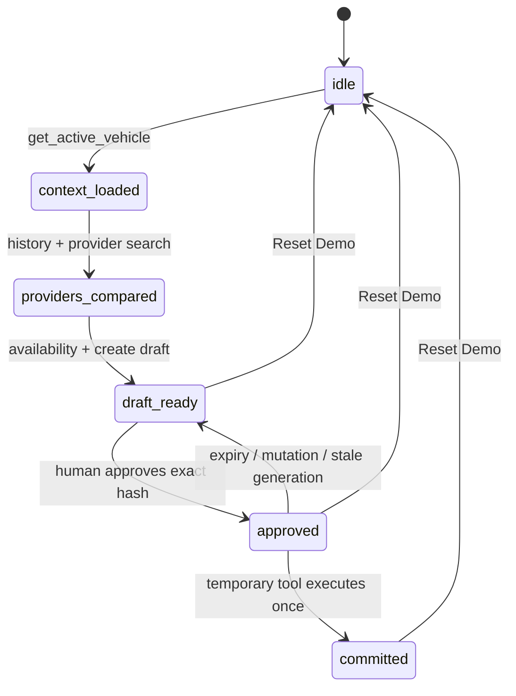

# Architecture

## Scope and source of truth

Agentic Service Dispatch is a browser-local proof of an approval-gated operational capability. It uses no server, database, model API, authentication, or external business API. The implementation follows the 26 August 2026 [WebMCP Draft Community Group Report](https://webmachinelearning.github.io/webmcp/) and the [official repository](https://github.com/webmachinelearning/webmcp): the imperative API is `document.modelContext`, registration accepts an AbortSignal, discovery uses `getTools()`, invocation uses `executeTool()`, and registry changes emit `toolchange`.

The implementation is checked against current primary sources. If `document.modelContext` is absent, the production adapter returns `null` and the UI reports that native WebMCP is unavailable.

## Domain state machine



`DispatchStore` owns every transition and invariant. Components request actions and render snapshots; they do not decide whether a commit is valid. The store is stable across renders and exposed through `useSyncExternalStore`, preventing tool callbacks from capturing stale React state.

## WebMCP adapter boundary

`native-adapter.ts` is the only production wrapper around the experimental browser types. It delegates registration, discovery, execution, and `toolchange` subscription to `document.modelContext`. Chrome's current testing implementation has returned registered schemas as strings and accepted a DOMString execution input, so the adapter serializes arguments only when the returned schema is a string. The standards path remains object input and both branches are covered by regression tests.

`fake-adapter.ts` is imported only by unit and component tests. Playwright injects an independent deterministic context before page code executes and labels the page **WebMCP test adapter**.

Unsupported production browsers never fall back to the fake adapter.

## Tool registration

`ToolRegistry.start()` serializes lifecycle operations and registers the five baseline definitions with one AbortController. It reads back `getTools()` and rejects missing or unexpected tools. Cleanup aborts the controller and verifies the registry is empty. Repeated or Strict Mode start/stop/start sequences are covered by tests and cannot create duplicate tools.

Soak coverage repeats 100 complete 5 → 6 → 5 + Reset lifecycles, 100 consecutive resets, 100 start/cleanup cycles, and a seeded 256-action ordering. These tests validate application and adapter invariants; they do not claim browser-engine conformance.

All schemas use `additionalProperties: false`. Fixed demo values use `const`, and runtime validation repeats schema constraints inside domain logic.

## Dynamic capability lifecycle

```mermaid
sequenceDiagram
  participant A as Agent / demo executor
  participant W as WebMCP registry
  participant D as Domain store
  participant H as Human
  participant U as Capability UI

  A->>W: execute five baseline tools
  W->>D: build DRAFT — NOT SUBMITTED
  W-->>U: getTools() = 5
  H->>D: Approve this exact dispatch
  D->>D: canonicalize + SHA-256 + TTL + nonce
  D-->>W: register commit tool with AbortSignal
  W-->>U: toolchange; getTools() = 6
  A->>W: execute commit(approval_id)
  W->>D: revalidate approval and commit once
  D-->>W: consume approval and return success
  W-->>A: settle successful executeTool() result
  W->>W: next task: abort temporary controller
  W-->>U: toolchange; getTools() = 5
```

A store subscription asks the registry to reconcile after approval, expiry, mutation, commit, or reset. Reconciliation is queued, so a double click or overlapping event cannot interleave register and revoke operations.

Successful commit revocation is deliberately scheduled for the next task. Native Chrome testing found that aborting the registration signal before the successful callback result crossed the browser boundary could turn a valid commit into an `UnknownError`. Domain authority is consumed synchronously; only physical unregistration waits one task, after which `getTools()` must show the exact five-tool baseline. Expiry, mutation, reset, cleanup, and registration failure still revoke without that success-settlement delay.

## UI synchronization

The capability panel never derives tool presence from the dispatch phase. `useCapabilities()` subscribes to `toolchange`, calls the adapter's `getTools()`, and renders only that returned list. A monotonic refresh generation prevents an older asynchronous read from overwriting a newer tool surface. The panel therefore can show missing or unexpected tools and lifecycle errors rather than presenting an assumed success state.

The audit log is driven by actual store updates with an injected clock. No server/client fixed-time text is rendered, avoiding hydration mismatches. The approval countdown is client-only and its interval is cleaned up on phase change or unmount. A synchronous action lock also closes the interval before React can paint a disabled Run, Approve, Commit, or Reset control.

## Exact-draft hash binding

The approved object includes vehicle, provider, slot, price, scope, and rationale. `canonical-json.ts` recursively sorts object keys, rejects unsupported JSON values and cycles, and produces stable UTF-8 bytes. SHA-256 binds the approval to the full canonical draft. Commit recomputes the current hash and rejects any mismatch.

## Expiry, one-time use, and idempotency

Approval expires 120 seconds after creation. The store uses an injectable clock for deterministic boundary tests. Commit requires the current approval ID, approved status, unused record, live TTL, matching draft hash, uncommitted dispatch, unused idempotency key, and current registration generation. It marks the key used and approval consumed before returning the fictional commit result.

The one-time nonce is generated with `crypto.randomUUID()` and is part of the approval record; it is never accepted from a tool caller. The idempotency key prevents replay even if invocation races are attempted.

## Reset

Reset increments the approval generation, clears in-flight approval state and used keys, returns the domain snapshot to `idle`, aborts any temporary tool, and reconciles the native registry to exactly five baseline tools. It is safe to invoke repeatedly.

## Failure handling

Domain failures use explicit codes such as `APPROVAL_NOT_FOUND`, `APPROVAL_EXPIRED`, `APPROVAL_ALREADY_USED`, `DRAFT_CHANGED_AFTER_APPROVAL`, `CAPABILITY_NOT_AVAILABLE`, and `DISPATCH_ALREADY_COMMITTED`. Registration failure invalidates the approval and returns the phase to `draft_ready`. Unexpected baseline or duplicate tools fail registry verification. UI errors use an accessible alert and never convert failure into a displayed success.
