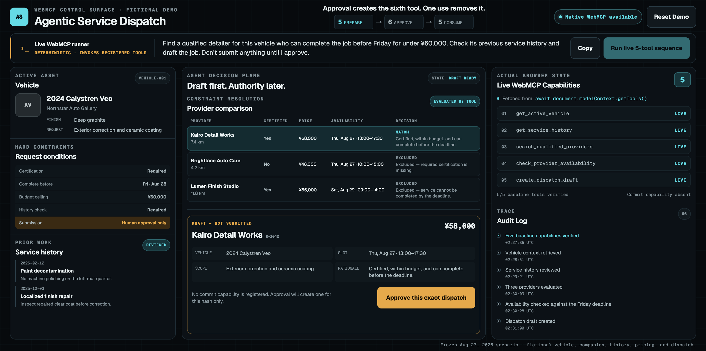
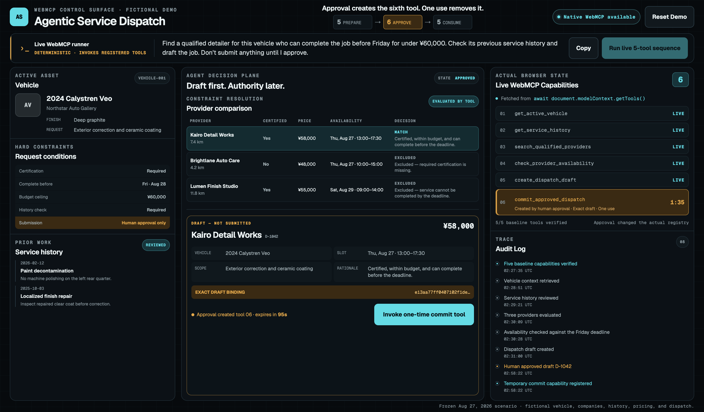
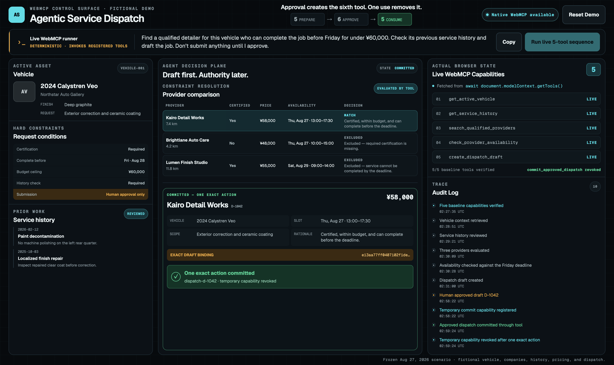

# Real-agent verification — 2026-08-31

**Tier A: natural-language request → five preparation tools → human exact-draft approval → Codex commit → capability revocation.**

Route: **Codex + official Chrome DevTools for agents**, using Google's [official ChromeDevTools/chrome-devtools-mcp](https://github.com/ChromeDevTools/chrome-devtools-mcp). This is not ChatGPT Site tools.

## Scope and environment

The run used the [public application](https://agentic-service-dispatch.vercel.app), whose final-candidate runtime comes from source `ef35cfc`. Verification date: **2026-08-31 (JST)**. Chrome **151.0.7922.174** stable, official Chrome DevTools MCP **1.8.0**, Codex CLI/app-server **0.151.0-alpha.7.2**, model **gpt-5.6-sol**. Chrome used an isolated temporary profile, not the entrant's personal profile.

The app code and deployment were not changed for this run. A local transport/logger recorded the official Codex app-server's activity; it did not implement browser or WebMCP execution. The actual model chose the tools and arguments below. The on-page deterministic runner, Playwright, a test adapter, and direct JavaScript execution were not used.

## Exact initial business prompt

The public URL was supplied with this request; it contained no page-tool names or execution order:

> Find a qualified detailer for this vehicle, available before Friday, under ¥60,000. Check its previous service history and draft the job. Do not submit anything until I approve.

The official navigation response exposed the page's actual tool definitions. Codex selected calls from those definitions and consumed their results. The explicit `list_webmcp_tools` call was made after draft creation, not before the first page-tool call.

## Recorded activity excerpt

Times are JST on 2026-08-31. Every page-tool execution below used the official **`execute_webmcp_tool`** wrapper and returned **`Completed`**. This is an edited factual activity excerpt, not a reconstruction of private model reasoning.

| Time | Page tool | Arguments |
| --- | --- | --- |
| 11:28:51.815 | `get_active_vehicle` | `{}` |
| 11:29:21.472 | `get_service_history` | `{"vehicle_id":"vehicle-001"}` |
| 11:30:09.552 | `search_qualified_providers` | `{"service_type":"ceramic-coating","max_price_jpy":60000,"certification_required":true}` |
| 11:30:28.384 | `check_provider_availability` | `{"provider_ids":["provider-001","provider-002","provider-003"],"before":"2026-08-28T00:00:00+09:00"}` |
| 11:31:00.679 | `create_dispatch_draft` | `{"provider_id":"provider-001","slot_id":"slot-001","quoted_price_jpy":58000,"rationale":"Certified, within budget, and can complete before the deadline."}` |
| **11:58:22** | **Human approved exact draft D-1042** | **Application approval control; not an agent tool call** |
| 11:59:24.027 | `commit_approved_dispatch` | `{"approval_id":"approval-069bab31-801a-4a8b-8421-973a451076d5"}` |

The approval ID above is an expired, consumed identifier from the fictional, in-memory demo, not a credential. The commit returned `dispatch-d-1042`, with `committed_at` of `2026-08-31T02:59:24.022Z`.

After the human's approval, the model received only:

> The human has now approved the exact draft shown on the page. Complete only that approved dispatch, then verify the resulting authority and page state.

This follow-up did not name the commit tool or supply its approval ID. Codex rediscovered the new schema, selected the live identifier, executed once, and checked the result. Tool-call permission acknowledgements in the transport are not the application's human draft approval.

## Actual registry observations: 5 → 6 → 5

These were model-issued **`list_webmcp_tools`** calls:

| Time | Count | Registry result |
| --- | --- | --- |
| 11:31:18.649 | **5** | Draft ready; baseline tools only; no commit capability |
| 11:59:09.017 | **6** | After human approval; only `commit_approved_dispatch` added |
| 11:59:29.146 | **5** | After one successful commit; `commit_approved_dispatch` absent |

The baseline names in both five-tool results were `get_active_vehicle`, `get_service_history`, `search_qualified_providers`, `check_provider_availability`, and `create_dispatch_draft`.

## Captured page evidence

The original page-only screenshots contain fictional data and no browser tabs, personal account details, or local paths. They are stills from the actual run, not a continuous recording. The visible runner control belongs to the app but **was not used** in this run. Tool execution attribution comes from the recorded model activity above, not from screenshots alone. Screenshot audit timestamps are UTC, nine hours behind the JST table.

## Evidence boundaries

- This is real model-selected execution of registered native WebMCP tools, separate from the deterministic runner and the automated test adapter.
- **Reset Demo was not verified through this agent route.** The separate [human-operated native Chrome release gate](final-candidate-native-evidence.md) covers Reset and must not be relabeled as real-agent Reset evidence.
- Later cleanup reloaded the page and returned five tool definitions. Follow-up screenshot/snapshot/registry collection timed out, and a further retry was canceled. Reload is not the Reset button; neither the post-reload idle screen nor that Reset path is claimed. These collection issues occurred after the captured successful commit and revocation. Their cause was not established.
- The page is a frozen, fictional August 27/28 scenario with deliberately precise schemas, including constant arguments and ordering guidance. This verifies tool execution and the authority pattern, not unrestricted planning, general browser conformance, current provider availability, or a real commercial transaction.
- Service-history cautions were returned to and summarized by Codex. This run does not prove that those cautions were copied into the draft's work scope.
- No external reviewer, pilot user, measured time saving, revenue effect, or multi-industry adoption is claimed.
- The isolated session ended after verification. Process-only MCP configuration was removed by shutdown; the existing persistent Codex configuration remained unchanged.

The existing public [2:12 video](https://youtu.be/N8LuuoV7zKI) is separately labeled native Chrome footage using the deterministic runner. It is not presented as this real-agent run. The new evidence here supplements it.
